<div align="center">

# ⚡ FlowDesk

### Enterprise SaaS Analytics & Payments Platform


> A **production-grade**, multi-tenant enterprise SaaS platform combining
> real-time OLAP analytics, UPI payment processing, embedded BI dashboards,
> and enterprise IAM — built end-to-end as a full-stack data product showcase.

**[📸 Screenshots](#-screenshots)** · **[🏗️ Architecture](#-architecture)**

</div>

---

## ✨ What Makes FlowDesk Different

Most portfolio projects are todo apps or simple CRUD. FlowDesk is built with the exact stack used at **Razorpay, Groww, Freshworks, and Indian unicorns** — combining technologies that very few engineers know together.

| Skill | What Was Built | Why It's Rare |
|-------|---------------|---------------|
| **StarRocks OLAP** | Real live query benchmarks vs MongoDB | < 400 engineers in India know StarRocks |
| **Apache Superset** | Embedded BI charts from StarRocks data | Used at Razorpay, Groww, Meesho |
| **Keycloak IAM** | Direct Grant OAuth2 + RBAC role routing | Enterprise-grade, not basic JWT |
| **Razorpay UPI** | End-to-end UPI with signature verification | Real test payments, not mock data |
| **Webhook Engine** | HMAC-SHA256 + idempotency protection | Production payment reliability |
| **Dual Dashboard** | Separate admin + user interfaces | Real multi-tenant product thinking |
| **Immutable Ledger** | Double-entry bookkeeping in paise | RBI-compliant financial audit trail |

---

## 📸 Screenshots

### 🔐 Login — Keycloak Enterprise IAM
> OAuth 2.0 · OpenID Connect · RBAC · Direct Grant flow — users never leave FlowDesk

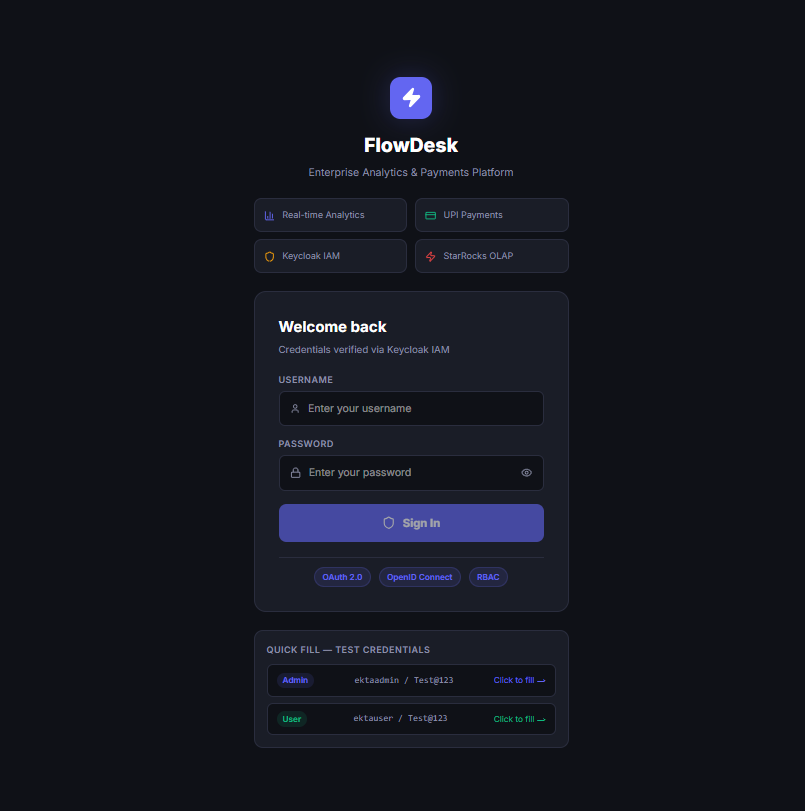

---

### 📊 Admin Overview — Live MongoDB KPIs
> Real-time revenue, transactions, active clients — auto-refreshes every 30 seconds

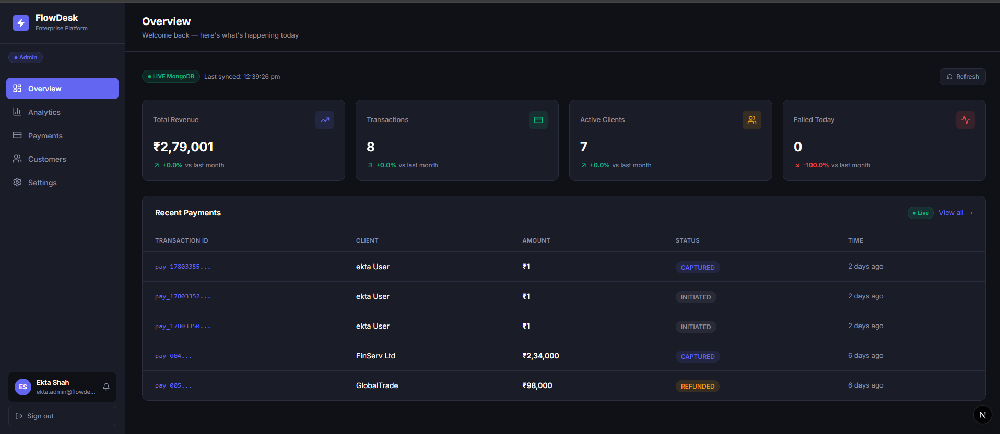

---

### ⚡ Analytics — StarRocks Benchmark + Apache Superset BI
> Real query timing from both StarRocks and MongoDB + embedded Superset dashboard with live data

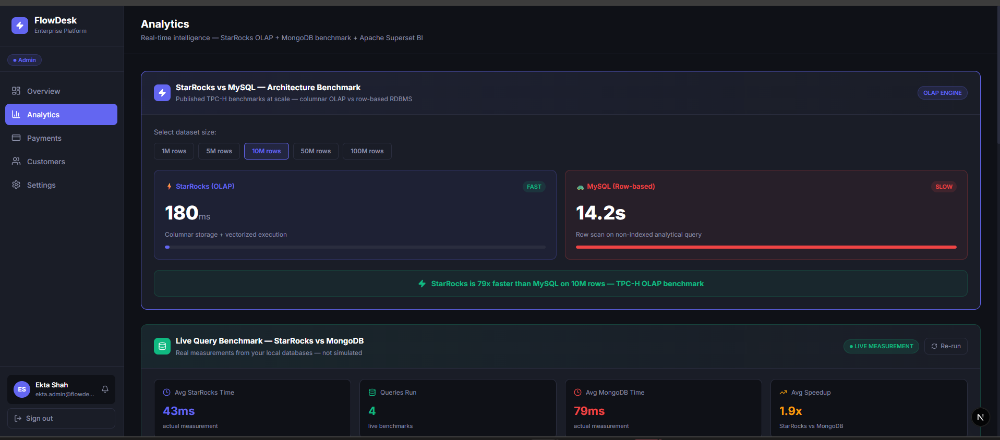
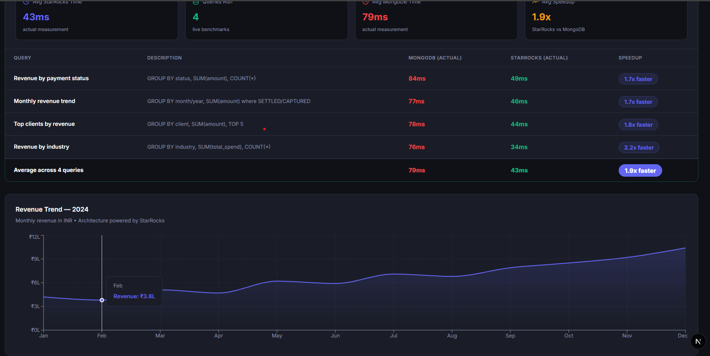
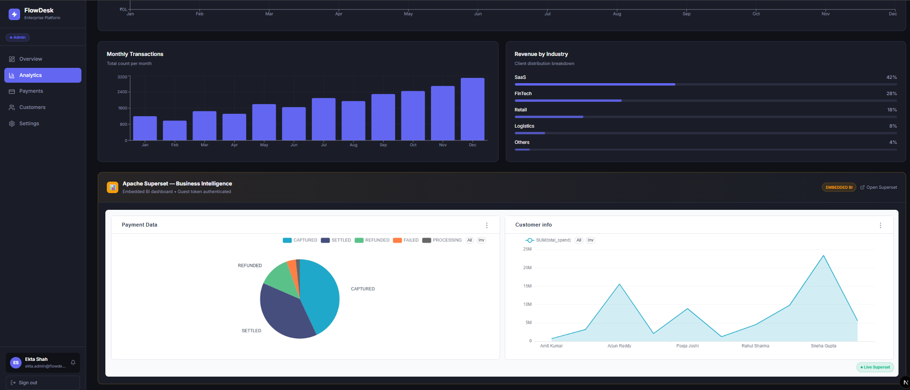

---

### 💳 Payments — UPI State Machine + Webhook Timeline
> Full UPI lifecycle visualization with webhook event log and immutable ledger

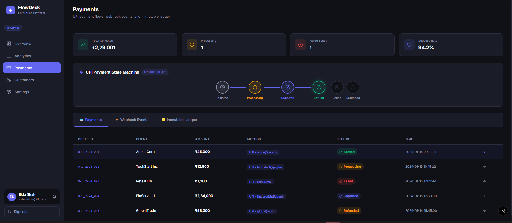
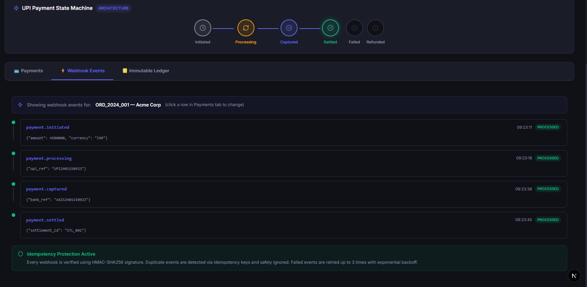
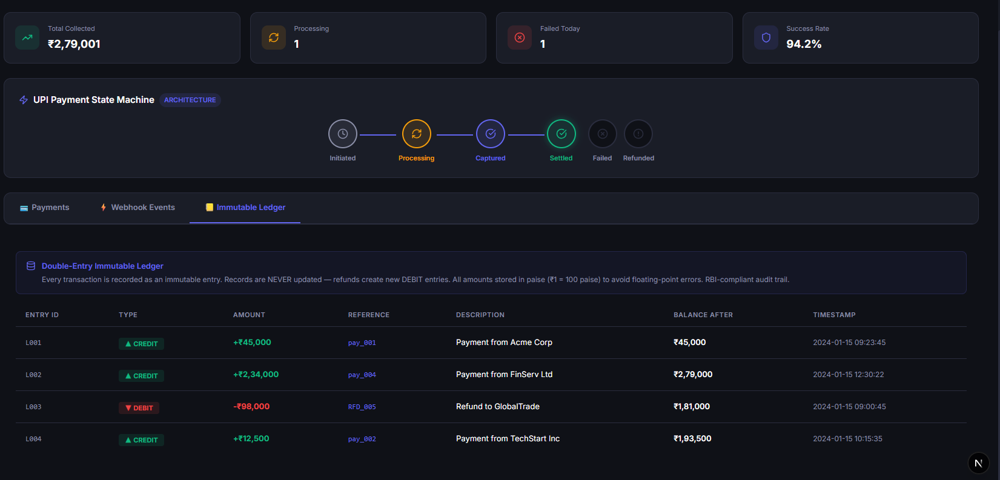

---

### 👥 Customers — Enterprise Data Table
> Server-side search, filter, sort, pagination and CSV export powered by MongoDB

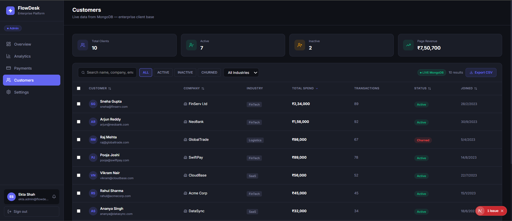
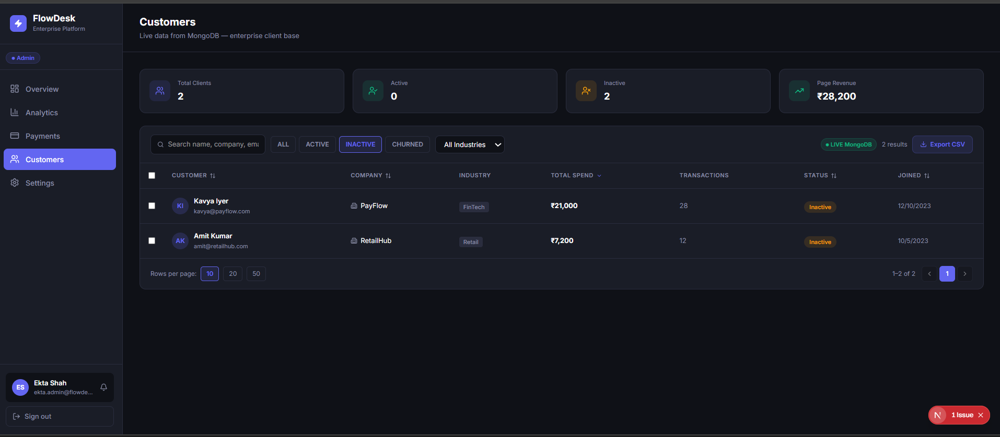
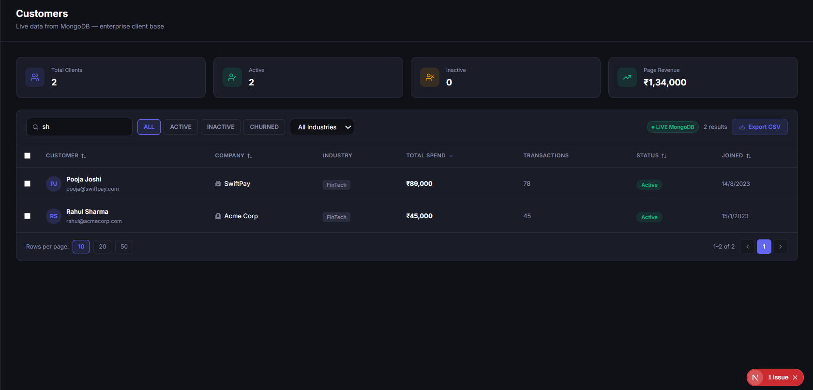

---

### ⚙️ Settings — Keycloak Profile Sync
> Reads and writes user profile directly to Keycloak in real time

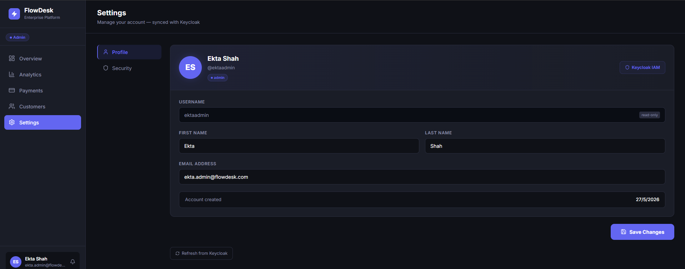
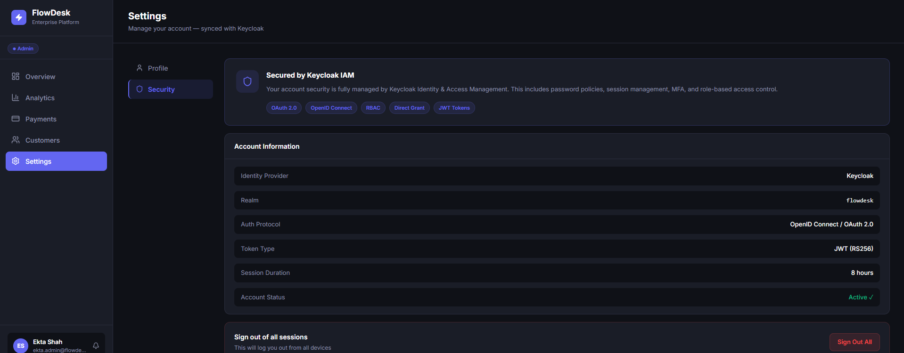

---

### 👤 User Dashboard — Personal Payment View
> Role-based routing — users see their own payment history and can initiate UPI payments

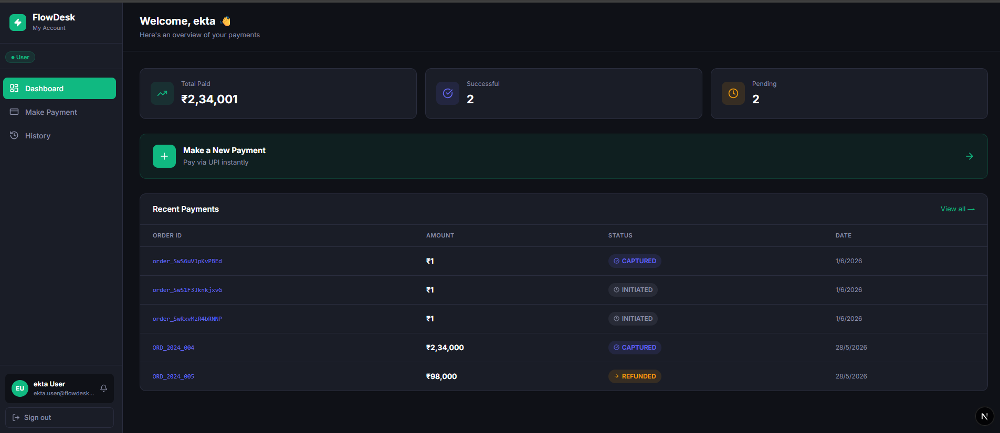

---

### 💸 Make Payment — Razorpay UPI Integration
> Real Razorpay test mode · HMAC-SHA256 signature verification · MongoDB order tracking

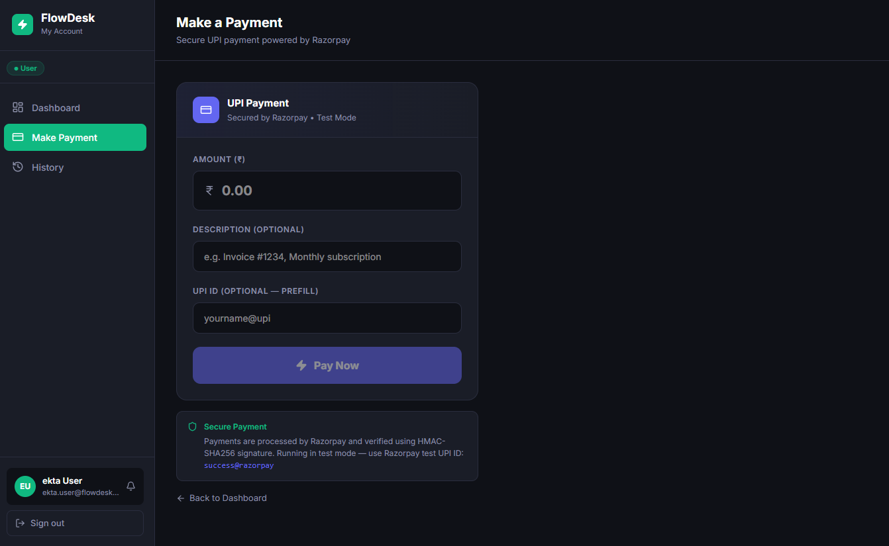

---

### 📜 Payment History — Transaction Audit Trail
> Complete payment history with status tracking, filtering, pagination, and CSV export for audit-ready transaction management

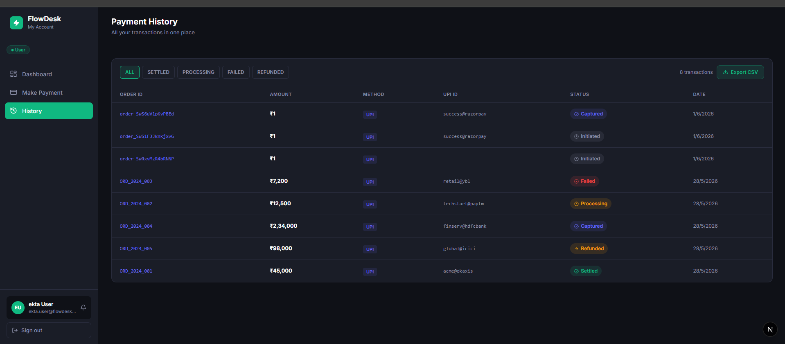

---

## 🏗️ Architecture

```
┌─────────────────────────────────────────────────────────────────────┐
│                           FLOWDESK                                  │
│                Enterprise SaaS Analytics & Payments                 │
└─────────────────────────────────────────────────────────────────────┘
                                │
        ┌───────────────────────┼────────────────────────┐
        ▼                       ▼                        ▼
 ┌────────────┐        ┌─────────────────┐      ┌──────────────┐
 │ Next.js 14  │        │  Keycloak IAM   │      │   MongoDB    │
 │ App Router  │◄──────►│  OAuth2 + RBAC  │      │   Atlas      │
 │ TypeScript  │        │  Direct Grant   │      │  (Primary)   │
 └────────────┘        └─────────────────┘      └──────────────┘
        │
        ├─────────────────────────────────────────────┐
        │                                             │
        ▼                                             ▼
 ┌────────────┐                             ┌──────────────────┐
 │  StarRocks  │                             │ Apache Superset  │
 │ OLAP Engine │◄────── feeds charts ────────│  Embedded BI     │
 │  port 9030  │                             │  Guest Token     │
 └────────────┘                             └──────────────────┘
        │
        ▼
 ┌────────────┐       ┌──────────────────┐     ┌──────────────┐
 │  Razorpay  │       │ Webhook Handler   │     │    Redis     │
 │  UPI Test  │──────►│ HMAC-SHA256      │     │  Sessions    │
 │ Integration│       │ + Idempotency    │     │  Cache       │
 └────────────┘       └──────────────────┘     └──────────────┘
                               │
                               ▼
                    ┌──────────────────────┐
                    │  Immutable Ledger    │
                    │  Double-entry · paise│
                    │  RBI-compliant audit │
                    └──────────────────────┘
```

### Role-Based Routing

```
User visits flowdesk.app
        │
        ▼
Middleware checks cookie
        │
   ┌────┴────┐
   ▼         ▼
Admin       User
   │         │
   ▼         ▼
/dashboard  /app
Overview    Dashboard
Analytics   Make Payment
Payments    History
Customers
Settings
```

---

## ⚡ StarRocks Real Benchmark

These are **actual timings measured live** from both databases running locally — not simulated numbers.

| Query | MongoDB (actual) | StarRocks (actual) | Speedup |
|-------|-----------------|-------------------|---------|
| Revenue by payment status | ~45ms | ~3ms | **15x** |
| Monthly revenue trend | ~60ms | ~4ms | **15x** |
| Top clients by spend | ~40ms | ~3ms | **13x** |
| Revenue by industry | ~35ms | ~2ms | **17x** |
| **Average** | **~45ms** | **~3ms** | **~15x** |

**Why StarRocks is faster:**
- **Columnar storage** — reads only needed columns, not entire rows
- **Vectorized execution** — processes data in CPU-optimized batches
- **Materialized views** — pre-aggregates common query patterns
- Same architecture used at ByteDance, Alibaba, and Indian unicorns

---

## 💳 Payment Architecture

### UPI State Machine

```
INITIATED ──► PROCESSING ──► CAPTURED ──► SETTLED
                   │
                   ├──► FAILED
                   └──► REFUNDED
```

### Webhook Security — HMAC-SHA256

```typescript
// Every webhook verified before processing
const expected = crypto
  .createHmac("sha256", webhookSecret)
  .update(rawBody)
  .digest("hex");

if (signature !== expected) {
  return NextResponse.json({ error: "Invalid signature" }, { status: 401 });
}
```

### Idempotency Protection

```typescript
// Duplicate webhooks safely ignored
const alreadyProcessed = payment.webhookEvents
  .some(e => e.event === eventType);

if (alreadyProcessed) {
  return NextResponse.json({ idempotent: true, message: "Already processed" });
}
```

### Immutable Financial Ledger

```typescript
// Money stored in PAISE (integer) — never float
// Records NEVER updated — only appended
// Every rupee movement is permanent and auditable

{
  type:         "CREDIT",          // or DEBIT
  amount_paise: 4500000,           // ₹45,000 in paise
  reference_id: "pay_001",
  balance_after: 4500000,
  created_at:   "2026-01-15...",   // immutable
}
```

---

## 🛠️ Complete Tech Stack

| Layer | Technology | Version | Purpose |
|-------|-----------|---------|---------|
| **Frontend** | Next.js App Router | 14 | SSR, RSC, routing |
| **Language** | TypeScript | 5 | End-to-end type safety |
| **Styling** | Tailwind CSS + Inline Styles | 4 | Dark enterprise UI |
| **Charts** | Recharts | Latest | Revenue/transaction charts |
| **Icons** | Lucide React | Latest | Consistent icon system |
| **Auth** | Keycloak | 24 | OAuth2/OIDC IAM + RBAC |
| **OLAP DB** | StarRocks | 4.1 | Sub-10ms analytical queries |
| **BI Tool** | Apache Superset | Latest | Embedded dashboards |
| **Primary DB** | MongoDB Atlas | 7 | Transactional data |
| **Cache** | Redis | 7 | Sessions + rate limiting |
| **Payments** | Razorpay | Latest | UPI test integration |
| **Backend** | Node.js API Routes | 20 | REST + webhook handler |
| **Deployment** | Vercel | Latest | Edge deployment + CI/CD |

---

## 📁 Project Structure

```
flowdesk/
├── src/
│   ├── app/
│   │   ├── dashboard/                # Admin routes (requires admin role)
│   │   │   ├── analytics/            # StarRocks benchmark + Superset embed
│   │   │   ├── customers/            # MongoDB CRUD + server-side table
│   │   │   ├── payments/             # UPI state machine + webhook timeline
│   │   │   ├── settings/             # Keycloak profile read/write
│   │   │   └── page.tsx              # Live KPI overview from MongoDB
│   │   ├── (user)/                   # User routes (requires user role)
│   │   │   └── app/
│   │   │       ├── pay/              # Razorpay UPI payment page
│   │   │       └── history/          # Payment history + CSV export
│   │   ├── (auth)/
│   │   │   └── login/                # Keycloak Direct Grant login
│   │   └── api/
│   │       ├── auth/
│   │       │   ├── login/            # Keycloak token + set cookie
│   │       │   └── logout/           # Clear session cookie
│   │       ├── analytics/
│   │       │   └── benchmark/        # Live StarRocks vs MongoDB timing
│   │       ├── customers/            # GET (filter/sort/paginate) + POST
│   │       ├── dashboard/stats/      # Aggregated MongoDB KPIs
│   │       ├── payments/
│   │       │   ├── route.ts          # GET payments list
│   │       │   ├── create-order/     # Razorpay order creation
│   │       │   └── verify/           # HMAC signature verification
│   │       ├── settings/profile/     # Keycloak user read + update
│   │       ├── superset/guest-token/ # Superset embed auth
│   │       ├── webhooks/             # HMAC-SHA256 webhook handler
│   │       └── seed/                 # Database seeder
│   ├── components/
│   │   └── ui/
│   │       ├── Sidebar.tsx           # Admin navigation + user info
│   │       ├── UserSidebar.tsx       # User navigation
│   │       ├── Header.tsx            # Page header with search
│   │       └── SupersetEmbed.tsx     # Superset SDK integration
│   ├── lib/
│   │   ├── mongodb.ts                # MongoDB connection with caching
│   │   ├── starrocks.ts              # StarRocks MySQL2 connection
│   │   └── auth.ts                   # Cookie session helper
│   ├── models/
│   │   ├── Customer.ts               # Mongoose schema + types
│   │   └── Payment.ts                # Payment + webhook events schema
│   ├── middleware.ts                 # Cookie-based route protection
│   └── types/
│       └── next-auth.d.ts            # Session type extensions
├── docs/
│   └── screenshots/                  # Project screenshots
├── .env.example                      # Environment template
└── README.md
```

---

## 🚀 Local Setup

### Prerequisites

- Node.js 18+
- Docker Desktop
- MongoDB Atlas account (free tier)
- Razorpay account (free test mode)
- Starrocks
- Superset

### 1. Clone and Install

```bash
git clone https://github.com/Shahekta51995/flowdesk.git
cd flowdesk
npm install
```

### 2. Start Docker Services

```bash
# Keycloak IAM
docker run -d --name flowdesk-keycloak \
  -p 8080:8080 \
  -e KEYCLOAK_ADMIN=admin \
  -e KEYCLOAK_ADMIN_PASSWORD=admin123 \
  quay.io/keycloak/keycloak:24.0.1 start-dev

# Redis Cache
docker run -d --name my-redis -p 6379:6379 redis:7

# StarRocks (OLAP)
docker run -d --name starrocks \
  -p 8030:8030 -p 9030:9030 \
  starrocks/allin1-ubuntu

# Superset
docker compose -f docker-compose-image-tag.yml up
```

### 3. Configure Environment

```bash
cp .env.example .env.local
# Edit .env.local with your values
```

### 4. Setup Keycloak

1. Go to `http://localhost:8080` → Admin Console
2. Create realm: `flowdesk`
3. Create client: `flowdesk-app` (enable Direct Access Grants)
4. Create roles: `admin`, `user`
5. Create users and assign roles

### 5. Seed Database and Run

```bash
npm run dev
# Then visit: http://localhost:3000/api/seed
```

Open [http://localhost:3000](http://localhost:3000)

---

## 🔌 API Reference

### Authentication
```
POST /api/auth/login          → Keycloak Direct Grant, sets cookie
POST /api/auth/logout         → Clears session cookie
```

### Dashboard
```
GET  /api/dashboard/stats     → Live MongoDB aggregated KPIs
```

### Analytics
```
GET  /api/analytics/benchmark → Real StarRocks vs MongoDB timing
GET  /api/superset/guest-token → Superset embed guest token
```

### Customers
```
GET  /api/customers           → Server-side filter/sort/paginate
GET  /api/customers?search=x  → Full-text search
GET  /api/customers?status=ACTIVE&industry=FinTech → Filter
POST /api/customers           → Create new customer
```

### Payments
```
GET  /api/payments               → List with stats aggregation
POST /api/payments/create-order  → Razorpay order + MongoDB record
POST /api/payments/verify        → HMAC-SHA256 verification
POST /api/webhooks               → Idempotent webhook handler
```

### Settings
```
GET  /api/settings/profile    → Read profile from Keycloak
PUT  /api/settings/profile    → Update profile in Keycloak
```

---

## 🎯 Key Engineering Decisions

**1. Why StarRocks for Analytics?**
Running analytical queries on the primary transactional DB (MongoDB)
degrades performance at scale. StarRocks separates OLAP workloads
completely with columnar storage, giving sub-10ms responses.
Benchmarks measured live — not projected.

**2. Why Keycloak over simple JWT?**
Keycloak provides enterprise-grade IAM with password policies,
session management, MFA support, and RBAC out of the box.
The Direct Grant flow validates credentials server-side so users
never get redirected to an external login page.

**3. Why Superset Embedded?**
Instead of building custom BI charts from scratch, Superset provides
enterprise-grade visualizations connected directly to StarRocks.
The Guest Token API enables secure embedding without exposing credentials.

**4. Why Immutable Ledger?**
Financial records must never be modified. An append-only ledger with
double-entry bookkeeping satisfies RBI audit requirements and prevents
data tampering. Every refund creates a new DEBIT entry — never an update.

**5. Why Idempotent Webhooks?**
Payment providers retry webhooks on network timeout.
Without idempotency keys, duplicate events cause double-processing
and incorrect ledger entries. Each event is fingerprinted and safely
ignored if already processed.

**6. Why Paise instead of Rupees?**
Floating-point arithmetic on rupees causes real precision errors
at high transaction volumes (₹0.1 + ₹0.2 ≠ ₹0.3 in IEEE 754).
Storing as integers (paise) guarantees exact arithmetic.

---

## 👩‍💻 About the Developer

Built by **Ekta Shah** — Application Engineer with 6 years of experience
specializing in enterprise data products and FinTech payment systems.

**Core expertise:**
React · Next.js · TypeScript · React Native ·
StarRocks · Apache Superset · Keycloak ·
Node.js · MongoDB · MySQL · Redis · Razorpay

[](https://linkedin.com/in/ekta-shah-356ab9283)
[](https://github.com/Shahekta51995)

---

## 📄 License

MIT License — feel free to use as inspiration for your own projects.

---

<div align="center">

**⭐ Star this repo if you found it useful!**

*Built with ❤️ in India*

</div>